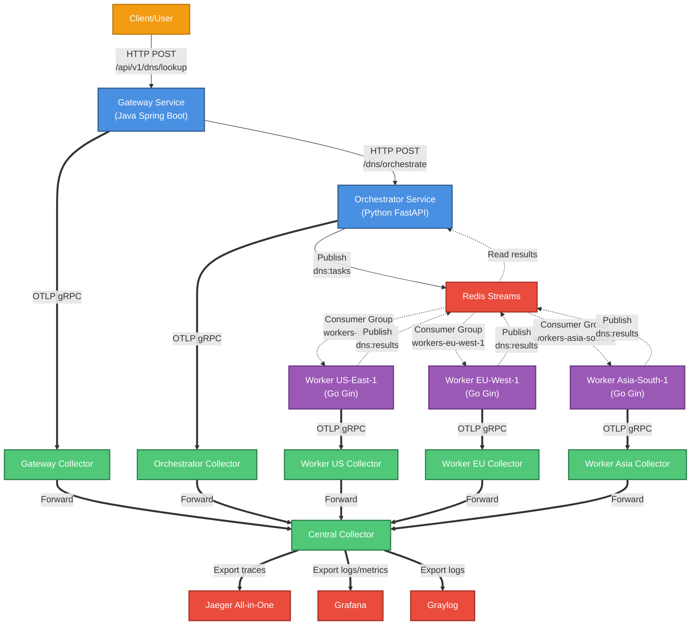

# OpenTelemetry Demo Service Topology

This document provides a visual map of all services in the OpenTelemetry distributed tracing demo.

## Architecture Overview



## Service Details

### Application Services

| Service | Technology | Port | Purpose |
|---------|-----------|------|---------|
| **Gateway** | Java 17 + Spring Boot 3.4.1 | 8080 | Entry point for DNS lookup requests |
| **Orchestrator** | Python 3.11 + FastAPI | 8001 | Coordinates DNS lookups across workers |
| **Worker US-East-1** | Go 1.23 + Gin | 8082 | Performs DNS lookups from US region |
| **Worker EU-West-1** | Go 1.23 + Gin | 8083 | Performs DNS lookups from EU region |
| **Worker Asia-South-1** | Go 1.23 + Gin | 8084 | Performs DNS lookups from Asia region |

### Infrastructure Components

| Component | Version | Ports | Purpose |
|-----------|---------|-------|---------|
| **Redis** | 7-alpine | 6379 | Event streaming with consumer groups |
| **Jaeger** | 1.51 | 16686 (UI), 4317 (OTLP) | Trace visualization and storage |
| **Grafana** | Grafana | 3000 (UI), 4317 (OTLP) | Log/metric exploration + Tempo/Loki |
| **Graylog** | Graylog 7.0 | 9000 (UI), 4317 (OTLP) | Log aggregation/search (Mongo+DataNode+Server) |

### OpenTelemetry Collectors

| Collector | Type | Configuration | Purpose |
|-----------|------|---------------|---------|
| **Central Collector** | Aggregator | Receives from all sidecars | Aggregates traces, exports to Jaeger |
| **Gateway Collector** | Sidecar | Receives from Gateway | Pre-processes Gateway traces |
| **Orchestrator Collector** | Sidecar | Receives from Orchestrator | Pre-processes Orchestrator traces |
| **Worker US Collector** | Sidecar | Receives from Worker US-East-1 | Pre-processes US worker traces |
| **Worker EU Collector** | Sidecar | Receives from Worker EU-West-1 | Pre-processes EU worker traces |
| **Worker Asia Collector** | Sidecar | Receives from Worker Asia-South-1 | Pre-processes Asia worker traces |

**Architecture:** All 6 collectors use the same sidecar configuration, forwarding traces to the central collector, which exports to Jaeger.

## Communication Patterns

### 1. HTTP Request Flow (Synchronous)
```
Client → Gateway → Orchestrator
```
- W3C TraceContext propagated via HTTP headers (`traceparent`, `tracestate`)
- Each hop creates child spans in the same trace

### 2. Redis Streams (Asynchronous Fan-Out)
```
Orchestrator → dns:tasks → [Worker-US, Worker-EU, Worker-Asia] → dns:results → Orchestrator
```
- **Fan-out pattern:** Each task message is consumed by ALL three workers
- **Consumer Groups:** Each worker has its own consumer group (e.g., `workers-us-east-1`)
- **Trace context:** Manually injected into Redis messages, extracted by workers
- **Geographic distribution:** Same DNS lookup performed from three regions

### 3. Trace Export Flow (OTLP)
```
Gateway → Gateway Collector → Central Collector → Jaeger
Orchestrator → Orchestrator Collector → Central Collector → Jaeger
Worker US → Worker US Collector → Central Collector → Jaeger
Worker EU → Worker EU Collector → Central Collector → Jaeger
Worker Asia → Worker Asia Collector → Central Collector → Jaeger
```
- **Protocol:** OTLP over gRPC
- **Multi-tier:** All services use sidecar collectors for per-service trace processing
- **Architecture:** 6 sidecar collectors + 1 central aggregator = 7 total collectors

### 4. Log Export Flow (OTLP)
```
Gateway/Orchestrator/Workers → Their Sidecar → Central Collector → Grafana LGTM + Graylog
```
- **Purpose:** Grafana LGTM surfaces logs/metrics, Graylog provides searchable log storage (Mongo+DataNode+Server).
- **Dual export:** Central collector forwards traces to Jaeger while streaming logs to the logging stack, keeping dashboards and search in sync.

## Key Architecture Patterns

### Multi-Language Distributed Tracing
- **Java (Gateway):** OpenTelemetry Java Agent 2.20.1 with auto-instrumentation
- **Python (Orchestrator):** OpenTelemetry SDK 1.38.0 with FastAPI instrumentation
- **Go (Workers):** OpenTelemetry SDK 1.35.0 with Gin instrumentation

### Trace Context Propagation
- **HTTP:** Automatic via W3C TraceContext headers
- **Redis Streams:** Manual injection/extraction using OpenTelemetry propagators
- **Correlation:** All operations for a DNS lookup share the same `trace_id`

### Geographic Fan-Out Pattern
- Single DNS lookup request triggers three concurrent lookups from different regions
- Each worker processes the same task from its geographic location
- Results aggregated in Orchestrator for comparison

### Clean API Design
- Public APIs have no observability details (no `trace_id` in request/response)
- Tracing handled transparently by OpenTelemetry plumbing
- Infrastructure concerns separated from business logic

## Data Flow Example

```
1. Client sends DNS lookup request to Gateway
   → Trace ID: abc123...

2. Gateway forwards to Orchestrator
   → Same trace, new span

3. Orchestrator publishes task to Redis Stream (dns:tasks)
   → Injects trace context into message

4. Three workers consume the task (fan-out)
   → Extract trace context, create child spans
   → Worker-US: Performs DNS lookup from US
   → Worker-EU: Performs DNS lookup from EU
   → Worker-Asia: Performs DNS lookup from Asia

5. Workers publish results to Redis Stream (dns:results)
   → Orchestrator aggregates results

6. Orchestrator returns aggregated response to Gateway
   → Gateway returns to Client

7. All traces exported to Jaeger
   → Complete end-to-end trace visualization
```

## Trace Visualization in Jaeger

Access Jaeger UI at: http://localhost:16686

Expected trace structure:
```
dns-gateway: POST /api/v1/dns/lookup
├─ dns-orchestrator: POST /dns/orchestrate
│  ├─ dns-orchestrator: publish_dns_task
│  ├─ dns-worker-us-east-1: process_dns_task
│  │  └─ dns-worker-us-east-1: dns_lookup
│  ├─ dns-worker-eu-west-1: process_dns_task
│  │  └─ dns-worker-eu-west-1: dns_lookup
│  ├─ dns-worker-asia-south-1: process_dns_task
│  │  └─ dns-worker-asia-south-1: dns_lookup
│  └─ dns-orchestrator: aggregate_results
└─ dns-gateway: call_orchestrator
```

## Network

All services run on the `oteldemo` Docker bridge network for service discovery and communication.

## Health Checks

- **Redis:** Internal health check via `redis-cli ping` every 5s
- **Jaeger UI:** http://localhost:16686

## Public Ports

| Port | Service | Purpose |
|------|---------|---------|
| 8080 | Gateway | HTTP API |
| 16686 | Jaeger | Web UI |

All other services communicate internally via the Docker network and do not expose public ports.

## Dependencies

Service startup order:
1. Infrastructure: Redis, Jaeger
2. Collectors: Central Collector → All 6 Sidecar Collectors
3. Application Services:
   - Orchestrator (depends on: Redis, Orchestrator Collector)
   - Workers (each depends on: Redis, respective Worker Collector)
   - Gateway (depends on: Orchestrator, Gateway Collector)
